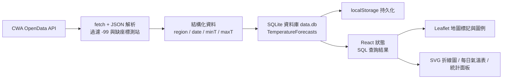

# 🌦️ 台灣即時氣象視覺化平台 (Taiwan Weather Tracker)

一個以「玻璃擬態 (Glassmorphism)」深色風格打造的台灣氣象儀表板：整頁以可自由縮放的互動式地圖為主體，觀測統計、測站詳情與一週氣溫預報以浮動面板疊加在地圖之上。所有氣象資料取自**交通部中央氣象署 (CWA) 開放資料**，一週氣溫預報會落地到**瀏覽器內執行的 SQLite 資料庫**，畫面上的縣市下拉選單、日期選擇、氣溫折線圖、每日氣溫資料表與地圖預報標記，全部由 SQL 查詢驅動。

專案採純前端 **CSR (Client-Side Rendering)** 架構，沒有自架後端伺服器，產物為純靜態檔案；資料庫、快取與統計都在瀏覽器端完成，因此可以直接部署在靜態託管服務上。

## 🌟 Demo 網站

線上即時展示（Vercel 部署）：<https://week3-eosin-iota.vercel.app/>


---

## 🧱 本專案是使用哪些東西做出來的

### 前端框架與工程工具

| 技術 / 工具 | 鎖定版本 | 在本專案中的角色 |
| --- | --- | --- |
| **React** | 19.3 | 介面元件與狀態管理；全站的圖層、地區、日期選取皆以 React state 為單一資料來源 |
| **TypeScript** | 6.0 | 全站型別安全，從 CWA JSON 解析到元件 props 都有明確型別（`StationData`、`TemperatureForecastRow`、`ForecastMarker` 等） |
| **Vite**（搭 **Rolldown** 捆綁器） | 8.3 | 開發伺服器與生產版打包；`?url` import 讓 `sql-wasm.wasm` 直接以靜態資源載入 |
| **@vitejs/plugin-react** | 6.1 | React JSX Transform 與快速刷新 (HMR) |
| **oxlint** | 1.85 | 靜態程式碼檢查，啟用 `react`、`typescript`、`oxc` 插件，並將 `rules-of-hooks` 設為 error |
| **ES Modules / strict TS 編譯選項** | — | `verbatimModuleSyntax`、`noUnusedLocals`、`erasableSyntaxOnly` 等設定保持程式碼乾淨 |

### 氣象資料來源（CWA Open Data）

| 資料集編號 | 內容 | 網站中的用途 |
| --- | --- | --- |
| `O-A0001-001` | 全台觀測站即時氣象觀測 | 地圖標記、測站詳情、即時概況統計與天氣提醒（溫度、濕度、風速、風向、雨量、天氣現象） |
| `F-D0047-091` | 臺灣各縣市鄉鎮未來 1 週逐 12 小時天氣預報 | 各縣市每日最低／最高氣溫 → 折線圖、氣溫資料表與地圖預報圖層 |

- 兩個資料集都由 `src/config.ts` 中的 `cwaEndpoint()` 統一組成 `datastore` REST 網址，輸出格式為 JSON。
- 請求金鑰優先讀取環境變數 `VITE_CWA_API_KEY`（可放在本機 `.env.local` 或 Vercel 專案的環境變數），避免金鑰寫死在程式碼與版本控制中；未設定時才退回內建金鑰，確保部署後仍可取得資料。

### 資料庫：跑在瀏覽器裡的 SQLite

| 技術 | 鎖定版本 | 用途 |
| --- | --- | --- |
| **SQLite（透過 [sql.js](https://sql.js.org/) 編譯成 WebAssembly）** | 1.14 | 在瀏覽器內建立 `data.db` 與 `TemperatureForecasts` 資料表，寫入與查詢都使用真正的 SQL |
| **`localStorage`** | 原生 API | 以 base64 儲存 `db.export()` 的資料庫二進位內容（鍵名 `data.db`），等同把 `data.db` 整個檔案保存起來；另以鍵名 `forecast-coords` 快取各縣市中心點座標 |

資料庫表設計與 SQL 用法：

```sql
CREATE TABLE IF NOT EXISTS TemperatureForecasts (
    region TEXT NOT NULL,
    date   TEXT NOT NULL,
    MinT   REAL NOT NULL,
    MaxT   REAL NOT NULL,
    PRIMARY KEY (region, date)
);
```

| SQL 用途 | 語法重點 |
| --- | --- |
| 寫入預報資料 | `INSERT … ON CONFLICT(region, date) DO UPDATE`（UPSERT），同資料重複抓取不會產生重複列 |
| 批次寫入 | `BEGIN TRANSACTION` / `COMMIT` / `ROLLBACK`，失敗整批回滾 |
| 過期資料清理 | `DELETE FROM TemperatureForecasts WHERE date < ?` |
| 下拉選單資料來源 | `SELECT DISTINCT region … ORDER BY region` |
| 日期膠囊資料來源 | `SELECT DISTINCT date … ORDER BY date` |
| 寫入結果驗證 | `SELECT COUNT(*)`、`COUNT(DISTINCT region)`、`COUNT(DISTINCT date)` |
| 防 SQL 注入 | 所有查詢一律使用 `prepare()` + `bind()` 參數化 |

> **為什麼放在瀏覽器端？** 網站部署於 Vercel 靜態託管，沒有可持久化檔案的伺服器，因此改用 sql.js 把整份 SQLite 資料庫以 base64 存在 `localStorage`，重開網頁仍可直接讀取上次保存的預報資料。

### 地圖與資料視覺化

| 技術 | 鎖定版本 | 用途 |
| --- | --- | --- |
| **Leaflet** | 1.9.4 | 地圖核心：縮放、拖曳、標記、彈窗、`flyTo` 動畫 |
| **React-Leaflet** | 5.0 | 以 React 元件宣告地圖、`TileLayer`、`Marker`、`Popup`，並用 `useMap()` 控制視角 |
| **`L.DivIcon`** | — | 用 HTML/CSS 變數打造自訂圓點標記與溫度色塊標記，顏色與尺寸直接由資料決定 |
| **CartoDB Voyager 柵格底圖**（OpenStreetMap 資料） | — | 清楚的街道與行政區底圖，與深色介面形成對比 |
| **原生 SVG 折線圖** | — | 最高／最低氣溫走勢**不使用任何圖表函式庫**，以 `<svg>` 手繪座標軸、網格線、折線、資料點與數值標籤 |
| **`ResizeObserver`** | 原生 API | 量測折線圖容器的實際寬度，以 1:1 實際像素繪製，調整視窗大小時圖表與座標文字都不會失真變形 |

### UI、樣式與字型

| 技術 | 版本 | 用途 |
| --- | --- | --- |
| **純 Vanilla CSS（未使用任何 CSS 框架）** | — | 以 CSS 自訂變數（`--glass-bg`、`--glass-blur`、`--accent-color` …）建立設計令牌，`.glass-panel` 以 `backdrop-filter: blur(16px)` 半透明疊加實現玻璃擬態深色主題 |
| **Lucide React** | 1.47 | 圖層切換、定位、刷新、測站、預報等介面圖示 |
| **Google Fonts — Inter** | — | 全站字型，搭配深色高對比文字 |
| **CSS `@media (max-width: 700px)`** | — | 手機版版面重排（圖層橫向排列、右側欄轉為底部抽屜） |

### 品質、版本控制與部署

| 項目 | 說明 |
| --- | --- |
| **Git / GitHub** | 原始碼版本控制與協作 |
| **Vercel** | 拉動 GitHub 分支後自動建置靜態網站並對外提供服務 |
| **型別檢查** | 建置流程呼叫 `tsc -b` 全專案編譯檢查，確保部署前沒有型別錯誤 |
| **靜態檢查** | `oxlint` 檢查 React Hooks 規則與 TypeScript 常見問題 |

### 幾個刻意的技術選擇

- **不裝 CSS 框架**：介面面板數量有限，用原生 CSS 變數就能維持一致性，也省下框架體積與學習成本。
- **不裝圖表函式庫**：只需要兩條折線，用 SVG 手繪反而能完全控制配色、標註與自適應尺寸。
- **不寫死 API 金鑰**：改由 `import.meta.env.VITE_CWA_API_KEY` 讀取，內建金鑰僅作為備援。
- **不依賴後端**：資料解析、去重、快取、統計全在瀏覽器完成，靜態託管即可上線。

---

## 🔀 資料流架構



即時觀測走「API → 解析 → React 狀態 → 地圖與面板」的直線路徑；一週預報則多繞經 SQLite 一趟，讓下拉選單、日期清單與折線圖資料都出自同一份可查詢的資料表，而不是散落在前端的暫存陣列。

---

## ✨ 網站功能總覽

| 功能 | 摘要 |
| --- | --- |
| 🗺️ 互動式台灣地圖 | 縮放、拖曳、自訂標記、彈窗詳細資料 |
| 📊 六種資料圖層 | 氣溫 / 雨量 / 風速 / 濕度 / 測站 / 氣溫預報即時切換 |
| 📍 一鍵定位 | 以瀏覽器定位功能把地圖移動到所在位置 |
| 📈 一週氣溫預報面板 | 縣市下拉、日期膠囊、SVG 折線圖、每日氣溫表 |
| 🎨 溫度四級分色地圖 | `<20 / 20–25 / 25–30 / >30 °C` 分級色塊與圖例 |
| 🔎 即時概況統計 | 最高溫、最低溫、最大雨量、最大風速（可隨縣市變化） |
| 🖱️ 測站詳情卡片 | 點選標記顯示氣溫、濕度、風速、雨量與觀測時間 |
| ⚠️ 天氣提醒 | 自動統計回報雨勢或強風的測站數量 |
| 💾 瀏覽器端資料庫 | 預報資料以 SQL 存取、離線仍可查看快取 |
| ⏱ 自動更新 | 觀測每 10 分鐘、預報每 30 分鐘自動刷新 |
| 📱 響應式版面 | 手機與桌面裝置都能操作 |

### 🗺️ 互動式氣象地圖

- 以台灣為中心的全螢幕地圖（CartoDB Voyager 街道底圖），支援滾輪縮放、拖曳與雙指手勢。
- 觀測站以自訂圓點標記呈現，**顏色依數值分級、尺寸依數值大小自動縮放**（10–20px），一眼看出高溫或強降雨區域。
- 點選任一標記會彈出 Popup，顯示站名、天氣現象、氣溫、濕度與風速。
- 右下角圖例會跟著目前圖層換內容：觀測圖層顯示漸層色帶與數值範圍，預報圖層顯示四級溫度分色。

### 📊 六種圖層與分色規則

| 圖層 | 顯示內容 | 分色規則 |
| --- | --- | --- |
| **氣溫** | 各觀測站氣溫 | `>32°C` 紅、`>28°C` 橘、`<15°C` 藍、其餘黃 |
| **雨量** | 各觀測站觀測雨量 | `>10 mm` 深藍、`>1 mm` 淺藍、其餘灰 |
| **風速** | 各觀測站風速 | `>10 m/s` 橘、`>5 m/s` 黃、其餘青綠 |
| **濕度** | 各觀測站相對濕度 | `>80%` 青、`>60%` 藍、其餘琥珀 |
| **測站** | 測站地理分佈 | 統一金色等大小標記，方便看覆蓋密度 |
| **氣溫預報** | 所選日期各縣市最高氣溫色塊 | `<20°C` 藍、`20–25°C` 綠、`25–30°C` 黃、`>30°C` 紅 |

### 📈 一週氣溫預報面板

- **可折疊面板**：標題列直接顯示目前資料庫涵蓋的「N 地區 · N 天」，點一下就收起或展開。
- **縣市下拉選單**：選項由 `SELECT DISTINCT region` 產生，切換後折線圖、氣溫表與即時概況會同步換成該縣市。
- **日期膠囊**：列出資料庫內所有預報日期（`M/D` 短標籤、滑鼠停留顯示完整日期與星期），點選即切換地圖預報圖層。
- **氣溫折線圖**：純 SVG 繪製，X 軸為日期、Y 軸為溫度，橘線為最高氣溫 `MaxT`、藍線為最低氣溫 `MinT`；每個資料點都標註實際溫度，Y 軸依當期溫度範圍自動決定刻度與網格線，並隨容器寬度重新計算尺寸。
- **每日氣溫資料表**：列出日期、星期、最低氣溫與最高氣溫，點選其中一列即可把地圖跳到該日期的預報分色。

### 🎨 預報地圖圖層

切換到「氣溫預報」圖層後，各縣市以其中心點顯示最高氣溫色塊標記（例如 `28°`），顏色依四級溫度分級；點擊標記可看該地區的日期（含星期）、最低氣溫與最高氣溫。日期膠囊或氣溫資料表切換日期時，地圖標記與圖例會立即跟著更新。

### 🔎 即時概況、測站詳情與天氣提醒

- **即時概況**：顯示最高溫、最低溫、最大雨量、最大風速四項統計，並標示是哪一個測站創下極值；統計範圍會跟著預報面板選取的縣市改變（比對方式為觀測站的縣市欄位，比不到時改以縣市中心點 40 公里半徑篩選，測站過少時改取最近 6 站；未選取縣市時為全台統計）。
- **測站詳情卡片**：顯示選取測站的氣溫、濕度、風速、雨量、天氣現象與觀測時間。
- **天氣提醒**：掃描全站測站的天氣現象文字（雨、雷、颱、強風、大風等關鍵字），即時回報有幾個測站出現明顯雨勢或風勢。
- **即時狀態列**：頂欄顯示目前上線測站總數與「LIVE」指示，並顯示觀測資料的最近更新時間。

### 📍 定位與視角控制

點擊頂欄的定位按鈕，會呼叫瀏覽器的 Geolocation API 取得目前位置，地圖以 0.8 秒動畫飛行到該座標並放大到 zoom 10，方便把自己周圍的觀測站與預報色塊對起來看。

### 💾 資料庫支援的功能

- 預報資料以真正的 SQL 寫入與讀取，縣市選單、日期清單、折線圖與氣溫表都從同一張 `TemperatureForecasts` 查詢得出。
- 使用主鍵 UPSERT，重複抓取同一份預報不會產生重複列；每次更新前以交易包裹，失敗整批回滾。
- 每次更新後自動移除已過期的預報日期，資料表不會隨時間無限膨脹。
- 資料庫以 base64 存在 `localStorage`，重新整理或隔天再開啟網站，仍可立刻看到上次保存的預報內容；各縣市中心點座標另有一份快取，讓地圖在 API 暫時不可用時依然能顯示預報標記。

### ⏱ 自動更新與容錯設計

| 項目 | 行為 |
| --- | --- |
| 即時觀測 | 每 10 分鐘自動重新抓取，面板顯示「更新於 HH:MM」 |
| 一週預報 | 每 30 分鐘自動更新，寫入後再以 SQL 重新查詢畫面 |
| 預報更新失敗 | 面板沿用資料庫中既有的預報資料，並顯示錯誤訊息，不會變成空白 |
| 資料庫初始化或保存失敗 | 僅記錄警告（例如無痕模式或容量已滿），網站其餘功能照常運作 |
| 資料品質 | CWA 的 `-99`、非數字欄位、缺座標的測站一律過濾，不進入地圖與統計 |
| 日期計算 | 星期以 UTC 推算，不受使用者瀏覽器時區影響 |

### 📱 響應式版面

螢幕寬度小於 700px 時自動切換為手機配置：頂欄收合品牌文字、左側圖層列改為横向排列並貼於頂部、右側欄轉為畫面底部可捲動的抽屜、預報面板預設收起、日期膠囊改為橫向捲動，讓地圖在小螢幕上仍保留最大能見度。

---

## 📁 專案結構

```
├─ index.html                     # 網站入口與 React 掛載點
├─ vite.config.ts                 # Vite + React 插件設定
├─ tsconfig.app.json              # 前端 TypeScript 編譯選項
├─ .oxlintrc.json                 # oxlint 規則（React Hooks / TypeScript）
├─ public/                        # 圖示與靜態資源
└─ src/
   ├─ main.tsx                    # React root 掛載與樣式匯入
   ├─ App.tsx                     # 狀態中樞：定時抓取、SQL 查詢結果、圖層／地區／日期選取
   ├─ config.ts                   # CWA 金鑰與 endpoint 網址組合
   ├─ api.ts                      # 即時觀測解析、縣市測站篩選（haversine 距離）
   ├─ forecast.ts                 # 一週預報解析、溫度分級、日期／星期工具、座標快取
   ├─ db.ts                       # sql.js 資料庫層：建表、UPSERT、查詢、統計、持久化
   ├─ index.css                   # 設計令牌、玻璃擬態、深色主題
   ├─ App.css                     # 面板版面、標記樣式、圖表配色、響應式規則
   ├─ types/sql.d.ts              # sql.js 的最小 TypeScript 型別宣告
   └─ components/
      ├─ WeatherMap.tsx           # Leaflet 地圖、圖層標記、彈窗與定位動畫
      ├─ WeatherOverlay.tsx       # 頂欄、圖層列、即時概況、測站詳情、提醒、圖例
      ├─ ForecastPanel.tsx        # 一週預報面板：下拉選單、日期膠囊、資料表
      └─ TemperatureChart.tsx     # 原生 SVG 最高／最低氣溫折線圖
```

---

## 📡 資料來源與授權

- **氣象資料**：[交通部中央氣象署開放資料平臺 (CWA Open Data API)](https://opendata.cwa.gov.tw/)
- **地圖底圖**：&copy; [OpenStreetMap](https://www.openstreetmap.org/copyright) contributors, &copy; [CARTO](https://carto.com/attributions)
- **圖示**：[Lucide](https://lucide.dev/)（ISC 授權）
- **字型**：[Inter](https://rsms.me/inter/)（SIL Open Font License）


